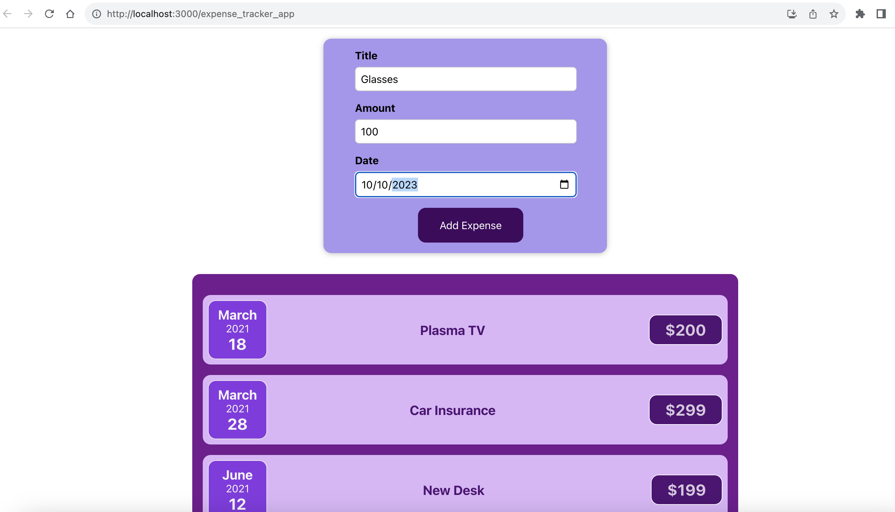
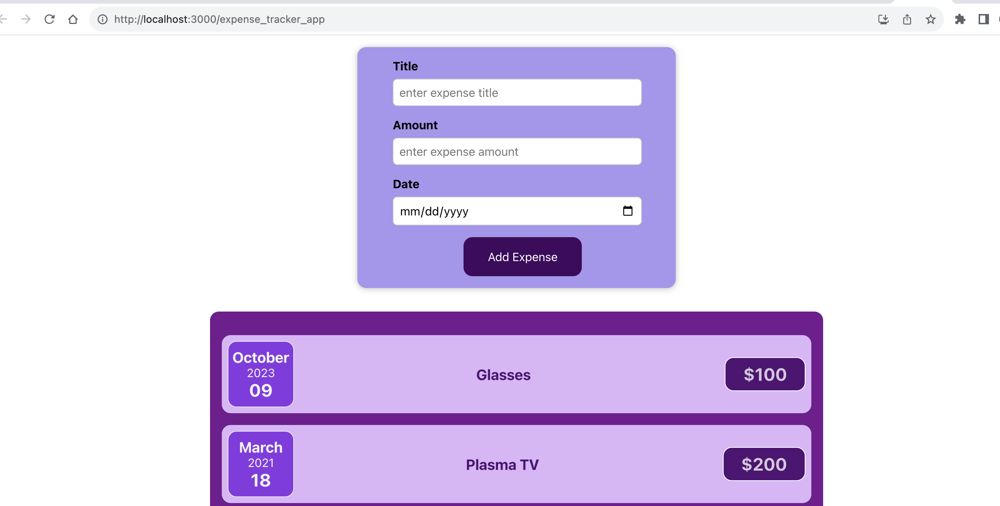
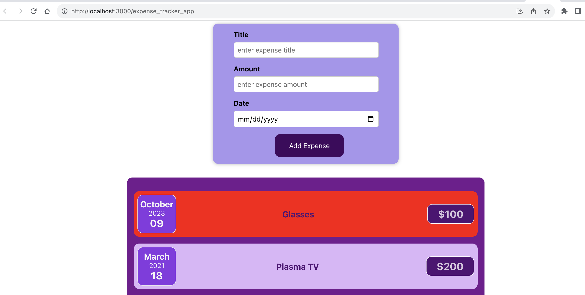
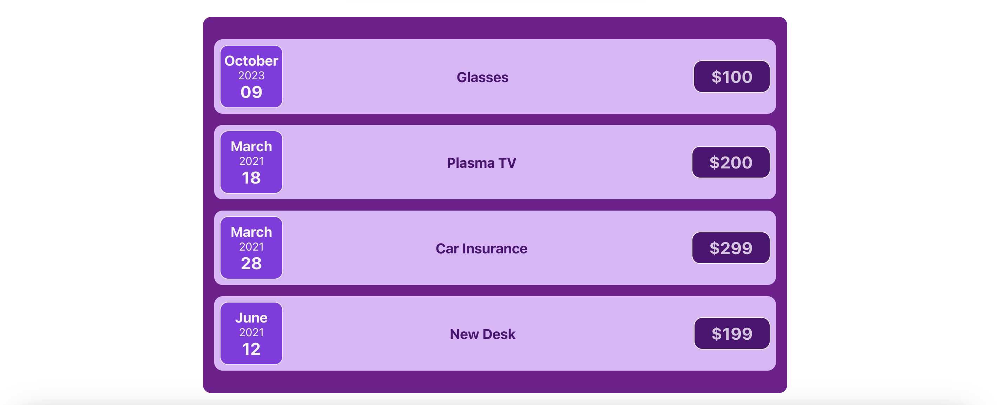

# Expense Tracker Application

- [Introduction](#introduction)
- [Key Features](#key-features)
- [How to Use](#how-to-use)
  - [Adding an Expense](#adding-an-expense)
  - [Viewing Expenses](#viewing-expenses)
  - [Deleting an Expense](#deleting-an-expense)
- [Getting Started](#getting-started)
- [Technologies Utilized](#technologies-utilized)
- [Contributor](#contributor)

## Introduction

Welcome to the Expense Tracker Application! This React-based solution empowers users to manage and monitor their expenses efficiently. The application enables users to input new expenses, view their entire expense history, and effortlessly delete entries as needed.

## Key Features

1. **Expense Entry:**

   - The application offers a streamlined "NewExpenseEntry" component for adding new expenses.
   - Users can input essential details such as title, amount, and date for each expense entry.

2. **Expense List:**

   - The "AllExpenses" component provides users with a comprehensive list of all recorded expenses.
   - Each entry showcases pertinent information including the expense title, amount, and date.

3. **Delete Functionality:**
   - Deleting an expense is made simple with the interactive delete button located next to each entry.
   - The app instantaneously updates to reflect any changes made to the expense list.

## How to Use

1. **Adding an Expense:**

   - Utilize the "NewExpenseEntry" component to seamlessly add new expenses.
   - Input the required details (title, amount, and date) and submit the form.

2. **Viewing Expenses:**

   - The "AllExpenses" component provides an organized display of all recorded expenses.
   - Each entry presents detailed information about the title, amount, and date of the expense.

3. **Deleting an Expense:**
   - Effortlessly remove an expense by clicking the designated delete button next to the respective entry.
   - The application dynamically updates to reflect the most current expense list.

## Getting Started

To experience the Expense Tracker Application locally:

1. Clone this repository to your local environment.
2. Navigate to the project directory.
3. Execute `npm install` to install essential dependencies.
4. Start the application with `npm start`.
5. Open your preferred browser and visit `http://localhost:3000` to explore the Expense Tracker App.

## Technologies Utilized

- React.js
- JavaScript
- HTML
- CSS

## Application Screenshots

1. **Adding a new expense.**
   

2. **Added expense**
   

3. **Delete Expense**
   

4. **View All Expenses**
   

## Contributor

- Ergun Oz

Feel free to explore and contribute to this Expense Tracker Application. For inquiries or suggestions, please contact me through my github page.

Happy tracking! 🚀
